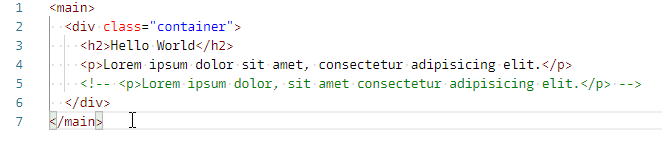
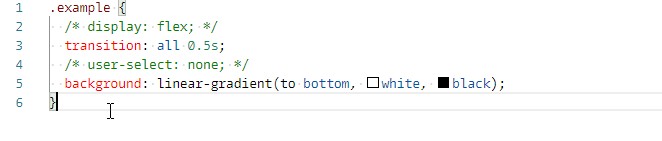

# One Line Comments

## About

If your code contains a comment, and you want to add a new comment to temporarily disable a block or portion of code, the built in commenting functionality does not actually place the comment tags in expected locations. If an existing comment is included in the content being commented out, the first instance of a --> or */ closing comment tag will end the entire comment.

This extension will convert pre-existing comments to safe characters, allowing a new block comment that includes the original comment. It also reverses the effect to uncomment the same block of code.

## Features

If you need to comment out a portion of your code that includes pre-existing comments, the native commenting functionality will not comment properly or preserve your existing comments. This extension will maintain your original comments and allow you to quickly toggle comments on sections of code.

## Examples

### HTML Syntax



```html
<main>
  <div class="container">
    <h2>Hello World</h2>
    <p>Lorem ipsum dolor sit amet, consectetur adipisicing elit.</p>
    <!-- <p>Lorem ipsum dolor, sit amet consectetur adipisicing elit.</p> -->
  </div>
</main>
```

Becomes:

```html
<!-- <main> -->
  <!-- <div class="container"> -->
    <!-- <h2>Hello World</h2> -->
    <!-- <p>Lorem ipsum dolor sit amet, consectetur adipisicing elit.</p> -->
    <!-- <!~~ <p>Lorem ipsum dolor, sit amet consectetur adipisicing elit.</p> ~~> -->
  <!-- </div> -->
<!-- </main> -->
```

### CSS Syntax



```css
.example {
  /* display: flex; */
  transition: all 0.5s;
  /* user-select: none; */
  background: linear-gradient(to bottom, white, black);
}
```

Becomes:

```css
/* .example { */
  /* /~ display: flex; ~/ */
  /* transition: all 0.5s; */
  /* /~ user-select: none; ~/ */
  /* background: linear-gradient(to bottom, white, black); */
/* } */
```

## Usage

Select the commented or uncommented line to execute the command.

### Default Keybindings

* Toggle comment/uncomment
  * Mac: <kbd>cmd</kbd>+<kbd>/</kbd>
  * Windows: <kbd>ctrl</kbd>+<kbd>/</kbd>

* To comment
  * Mac: <kbd>cmd</kbd>+<kbd>k</kbd> <kbd>cmd</kbd>+<kbd>c</kbd>
  * Windows: <kbd>ctrl</kbd>+<kbd>k</kbd> <kbd>ctrl</kbd>+<kbd>c</kbd>

* Uncomment
  * Mac: <kbd>cmd</kbd>+<kbd>k</kbd> <kbd>cmd</kbd>+<kbd>u</kbd>
  * Windows: <kbd>ctrl</kbd>+<kbd>k</kbd> <kbd>ctrl</kbd>+<kbd>u</kbd>

## Extension Settings

The following languages are supported:

* html
* css

## Known Issues

None at this time

## Release Notes

Full release notes are available in the CHANGELOG file.